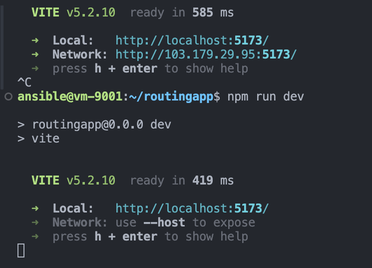
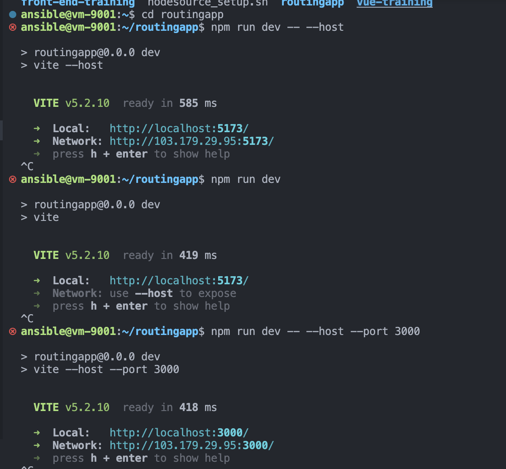
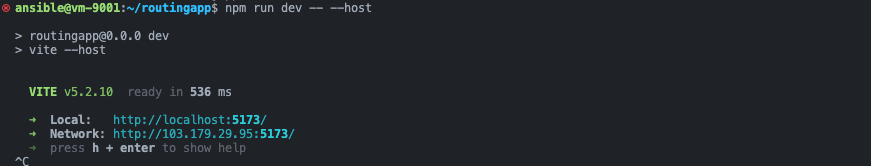
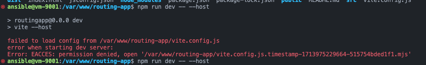
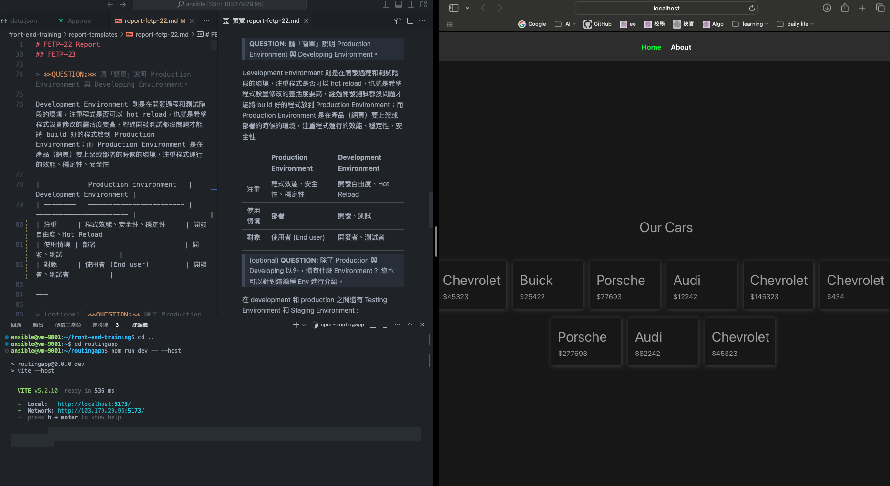

# FETP-22 Report

## INFORMATION
**GitHub ID**: `imyungchu`

## FETP-21

> **QUESTION:** 請簡單說明非對稱加密的概念。並說明 Public Key 與 Private Key 的用法。

非對稱加密是利用那個人公開的 public key 可以加密，但是只有那個人 Private Key 才能解開的問題，進而實現加密發送訊息給同學的功能。

@kdotwei : 反過來就是數位簽章！

在對稱加密中，加密解密用的是同一個 Key ，這樣可能會有流出問題。非對稱式加密則是透過每個人都公開 Public Key 且只有自己擁有對應的 Private Key 可以互相加密、解密，來做到用對方的 Public Key傳送給對方加密訊息，用自己的 Private Key 加密一個東西公開，大家都知道只有我的 Public Key 可以解出 Private Key 加密的內容，藉此來向大眾證明自己的身份，也就是數位簽章。

---

> **QUESTION:** 在這邊我們使用了加密演算法 ED25519。除了 ED25519 以外，還有一個很有名的加密演算法，叫什麼名字？

RSA ! 非對稱加密演算法 Rivest-Shamir-Adleman 

---

> (optional) **QUESTION:** 這個有名的加密演算法有什麼問題，用了什麼方式降低了這個問題的風險？

安全性的漏洞：
1. 如果 key 選擇質數的方式不夠隨機，就可能會被因數分解，破解加密。可以用偽隨機產生器來避免。
2. 如果 key 太小或彼此太相近，也很可能會被猜出，所以安全專家會建議最小 key 要大於 2048 bits。

---

## FETP-23

> **QUESTION:** 為何我們安裝了 Nginx 後，在瀏覽器輸入網址或 IP 就可以連到網站？而在先前的任務中都要加入 Port 號？

Nginx 可以讓我們在同一個 port 的主機，在不用輸入 port 的情況下運行，因為他是一個可以自動幫我們回應網站 request 的 web server。支援不同網址共享 80 port 實現一個主機同時跑多個網站，也就是一個「反向代理」的伺服器。

反向代理的觀念類似打電話去客服，我們會得到服務但不見得是同一個客服回答，但客服公司會去分派任務讓每個 request 都盡量有回應。之前要輸入 port 時，可能會有網址重疊問題，現在有了 Nginx 我們可以統一交由 Nginx 處理配置問題，進而幫助網站伺服器更有效率的連接。

@kdotwei : 嚴格說起來是 Nginx 一裝好，預設會監聽 80 Port，而 80 Port 正是 http 協議的預設 Port。當你使用 http 連線至指定的伺服器時，瀏覽器會幫你向伺服器的 80 Port 發送 Request。

---

> **QUESTION:** 如果我們同時在專案中使用 `npm run dev -- --host`，加 Port 與不加 Port 會有什麼差別？可以的話也請將兩者的截圖都放上來。
1. 加不加 `-- --host` 差別在會不會有 network 的連結，有加的話，只要有網路就可以連進去那個網址。

    

2. 加不加 `--port 8000` or `--port 3000` 跑出來的畫面都一樣，差別在網址後面的 port 會不一樣，預設是 `5173`。

    

---

> **QUESTION:** 為何要執行 `npm run install`？ 不執行會怎樣？

`npm install` 是用來裝那個專案需要的套件們（環境）的指令，如果沒有裝的話，專案很可能就會跑不起來。

---

> **QUESTION:** 不同前幾次任務，這邊使用 `run build` 而非 `run dev`，請問差別在哪？

`run dev` 是在 development 開發期間有更好的體驗，例如 hot module replacement 等等，是開發時測試環境的命令。但 `run build` 才可以將所有程式打包成一個可能開發起來不快，但使用效能會很快，是要上架時應該要跑的命令。

> **QUESTION:** 在 Nginx 中 `root` 這個設定項代表著什麼？

`root` 代表根目錄的位置，也就是在部署網站時，會去 `root` 的路徑尋找 `index.html` 來作為使用者點進網站之後會看到的畫面。

---

> **QUESTION:** 為什麼我們要設定 `/var/www/routingapp/dist` 為 `root` ，而非 `/var/www/routingapp/` 或其他目錄？

`dist` 的英文全文是 distribution 。這個資料夾是在運行完 `npm build` 之後自動產生、可以部署到網站的靜態文件們。 `dist` 中的靜態文件們通常會是壓縮、優化過的，能提供最佳效能、安全性的網頁。另外，透過部署 `dist` 資料夾中的 `npm build` 之後產生的東西，可以跟 `src` 也就是網站的 source code 做出區別，進而保障網頁安全性。

---

> **QUESTION:** 請「簡單」說明 Production Environment 與 Developing Environment。

Development Environment 則是在開發過程和測試階段的環境，注重程式是否可以 hot reload，也就是希望程式設置修改的靈活度要高，經過開發測試都沒問題才能將 build 好的程式放到 Production Environment；而 Production Environment 是在產品（網頁）要上架或部署的時候的環境，注重程式運行的效能、穩定性、安全性

|          | Production Environment   | Development Environment |
| -------- | ------------------------ | ----------------------- |
| 注重     | 程式效能、安全性、穩定性     | 開發自由度、Hot Reload  |
| 使用情境 | 部署                      | 開發、測試              |
| 對象     | 使用者 (End user)         | 開發者、測試者          |

---

> (optional) **QUESTION:** 除了 Production 與 Developing 以外，還有什麼 Environment？ 您也可以針對這幾種 Env 進行介紹。

在 development 和 production 之間還有 Testing Environment 和 Staging Environment :

1. 前者 `Testing Environment` 主要是讓測試人員可以在不同的環境（例如不同瀏覽器）手動或自動測試，可以讓測試人員用一些 log 的方式記錄下錯誤，給開發人員及時修正，可以邊開發邊進行。

2. 後者 `Staging Environment` 是在開發差不多完成時，部署到一個跟 Production Environment 盡量完全相同的地方，做「負載測試」（模擬大量使用者、大量需求等等極端狀況）確保部署之後的網路、程式都能正常運行，之後才可以放到 Production Environment。

---

> **QUESTION:** 可以注意到在 Server 上有兩個地方都有 `routingapp` 的專案： `~/ansible/routingapp` 與 `/var/www/routingapp`。
>
> 請問您認為以上兩個目錄，誰更適合作為 Production，誰適合作為 Developing？

`~/ansible/routingapp` 適合 Developing 而 `/var/www/routingapp` 適合 Production。因為透過 root 連接的地方，也就是最後透過 Nginx 部署到 `nycu.me` 網站的是 `/var/www/routingapp/dist` 裡面的資料，而 `~/ansible/routingapp` 裡的修改不會影響，適合作為開發和測試的環境。

---

> **QUESTION:** 前面請各位同時使用 `npm run dev -- --host` 並截圖差異。請根據此提示，說明前一個問題的為何會這樣判斷。

- In development environment, the command `npm run dev -- --host` shown normal as below:

     

- In production environment, the command `npm run dev -- --host` failed as below:

    

---
## OTHERS

> 這裡可以寫下任何你想紀錄或你想展示的內容！

一開始在建立自己的 routing-app 的時候中間多了一個 `-` 導致 `fetp-23` 卡了一陣子。但最後還是發現上傳到的版本有些不滿意（navbar沒有置中加底色），修改 `routing-app` repository 中的檔案之後，發現 `var/www/` 底下的網站 `yungchu.nycu.me` 並沒有更新。蠻好奇是為什麼的，但還沒有找到原因，或是說也沒有找到更新方式。可能要再 build 一次嗎？結果還是沒有改變，現在就是有兩種版本的網頁 😂

下面是我想展示的：

在寫任務的過程很有成就感，我覺得跟規劃課程的用心呈現正相關！非常感謝 SDC  & AL 讓我們可以透過這種紀錄成長的方式學習。本來很沒有動力完成，但發現自己更沒有動力完成其他作業，於是選擇這個任務，完成之後感覺很開心！份量規劃的很好，可以在一天內完成。

很喜歡每個任務會有幾題思考的題目，在搜尋答案、紀錄的過程可以有好的學習方向，透過輸出來增進記憶與理解，是很幸福的事情。