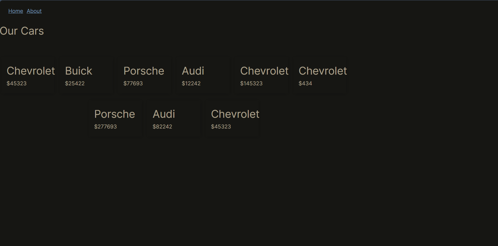
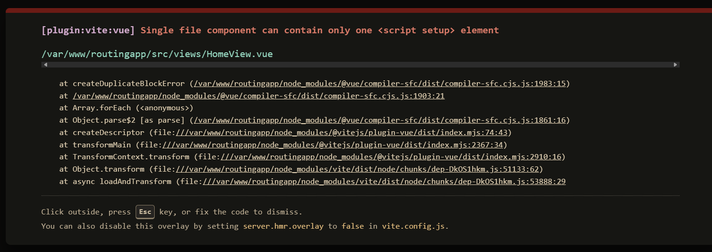
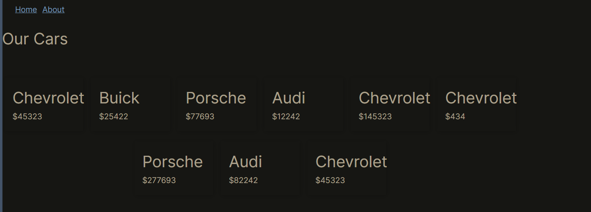

# FETP-22 Report

## INFORMATION
**GitHub ID**: lai20021015

## FETP-21

> **QUESTION:** 請簡單說明非對稱加密的概念。並說明 Public Key 與 Private Key 的用法。

非對稱加密方法是一種利用一對 key 來進行 encrypt 和 decrypt 的過程。public key 只任何人都可以使用，而 private key 是只有具相應鑰匙的人才能解密。例如public key 即使被知道，也無法解密由 public ke y加密的訊息，除非有 private key。

---

> **QUESTION:** 在這邊我們使用了加密演算法 ED25519。除了 ED25519 以外，還有一個很有名的加密演算法，叫什麼名字？

原本想回答是DES和AES，但他們都是對稱性加密。但答案是RSA，也是一種非對稱加密演算法。

---

## FETP-23

> **QUESTION:** 為何我們安裝了 Nginx 後，在瀏覽器輸入網址或 IP 就可以連到網站？而在先前的任務中都要加入 Port 號？

因為 Nginx 預設會監聽 80（HTTP）和 443（HTTPS）這兩個端口。如果輸入時沒有指定，瀏覽器便會預設這兩個 port 來嘗試連接。

---

> **QUESTION:** 如果我們同時在專案中使用 `npm run dev -- --host`，加 Port 與不加 Port 會有什麼差別？可以的話也請將兩者的截圖都放上來。

不加上 port 的話，無法直接導向我們要的網頁。

---

> **QUESTION:** 為何要執行 `npm run install`？ 不執行會怎樣？

安裝 Node.hs 專案的一些封包，否則專案會無法正常運行。

---

> **QUESTION:** 不同前幾次任務，這邊使用 `run build` 而非 `run dev`，請問差別在哪？

run dev 用於開發環境。適用於開發者。較多開發專用功能可以更輕易地進行調試。

run build 用於生產環境，執行此命令時，應用程式會被編譯和打包。通常會被自動優化和最小化代碼。不會包含任何開發專用的工具。

---

> **QUESTION:** 在 Nginx 中 `root` 這個設定項代表著什麼？

如果 root 設定為 /var/www/html, 那麼 Nginx 會在 /var/www/html/index.html 找到該文件。

---

> **QUESTION:** 為什麼我們要設定 `/var/www/routingapp/dist` 為 `root` ，而非 `/var/www/routingapp/` 或其他目錄？

前者通常包含經過編譯和打包的 source，當執行 npm run build 時, 這些 source 會被放在 dist 這個目錄中。

好處是，這樣可以直接提供編譯和打包後的code，可以增加效率和增加安全性。

---

> **QUESTION:** 請「簡單」說明 Production Environment 與 Developing Environment。

Developing Environment 是開發者用來編寫和測試新代碼的地方。Production Environment 是用戶實際使用應用程式的地方。此處的代碼會經過優化以提供用戶更好、更有效率的體驗。

---

> (optional) **QUESTION:** 除了 Production 與 Developing 以外，還有什麼 Environment？ 您也可以針對這幾種 Env 進行介紹。

還有像是 Testing 和 Local。Testing 用於執行自動化測試和驗證程式碼功能。Local 指開發者在自己的電腦進行初步開發和測試的環境。

---

> **QUESTION:** 可以注意到在 Server 上有兩個地方都有 `routingapp` 的專案： `~/ansible/routingapp` 與 `/var/www/routingapp`。
>
> 請問您認為以上兩個目錄，誰更適合作為 Production，誰適合作為 Developing？

ansible 更適合當作 Developing
/var/www 這是 Unix 和 Linux 系統中常見的用於存放網頁的目錄。這些文建會被 web 伺服器提供給用戶。將應用程式放在這裡可以讓它直接被 web 伺服器訪問。

---

> **QUESTION:** 前面請各位同時使用 `npm run dev -- --host` 並截圖差異。請根據此提示，說明前一個問題的為何會這樣判斷。

比較了一下，我看不太出差別...
---

## OTHERS

> 這裡可以寫下任何你想紀錄或你想展示的內容！

練習過程中忘記加入ssh config這一段，導致key無法和Github進行連線。
原本以為是公鑰設定的問題，重複生成了好多的rsa key。

另外，我用到了重啟 Vite 和功能。可以利用 ps aux 查看進程 在用 grep 命令來過濾。
如 ps aux | grep vite 找出重啟 vite 的 ID。
原本想要除 vue 網頁一直打不開的 bug，後來發現是 首頁的vue設定了 兩個以上的script，這樣的設定是不被允許的。